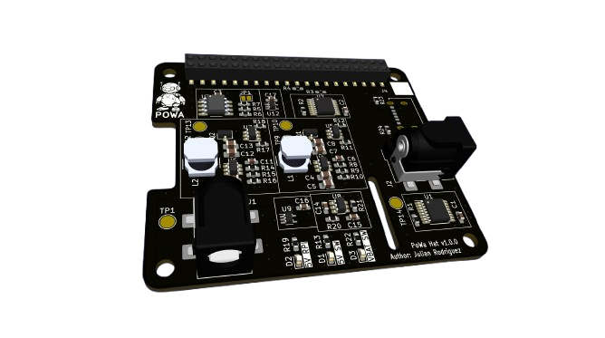

# Raspberry Pi Warden Hat

This repository contains the kicad project of Power Warden HAT.

   

     
   

## Board description

The HAT is designed to be used with a Raspberry Pi to monitor and control power domains.
It features:

- An individual 5 V power domain.
- An VBAT power domain.
- A dedicated 5 V power supply for the Raspberry Pi.
- An EEPROM to store the HAT configuration.

## Power domains

Each power domain is equipped with a current sensor and an enable input.
The enable input is routed directly to some Raspberry Pi GPIO, allowing the user to control the state of the power domain.
Besides that, the enable input is also controlled by the current sensor, which can disable the power domain quickly in case of over-current.

## 40-pin connector

This HAT is using an SMT 2x20 pin connector for the Raspberry Pi GPIOs. The reasons behind this are:

- This connector has a smaller footprint.
- Enables to only have assembly in one side of the board.
- Allows to use the Raspberry Pi GPIOs without the need to add another header to the board.

In order to connect the HAT to the Raspberry Pi, you need a stacking header.
The [GPIO Stacking Header for Pi A+/B+/Pi 2/Pi3 - Extra-long 2x20 pins from Adafruit industries will do the trick](https://www.adafruit.com/product/2223).

## Software support

There already exists a python library to control the HAT, which can be found at [powa's repository](https://github.com/marifante/powa).

Besides that, there is also a Yocto layer that includes all the necessary software to use the HAT, which can be found at [Power Warden Yocto Layer](https://github.com/marifante/meta-power-warden).

   

     
   

